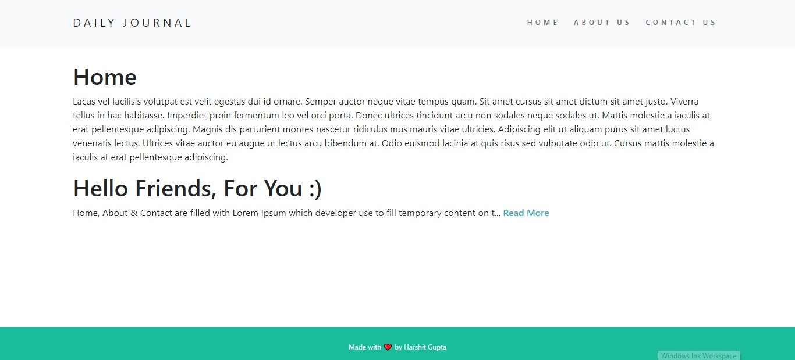
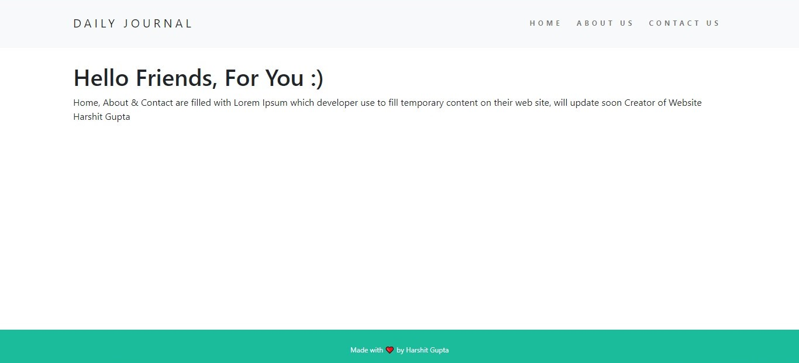
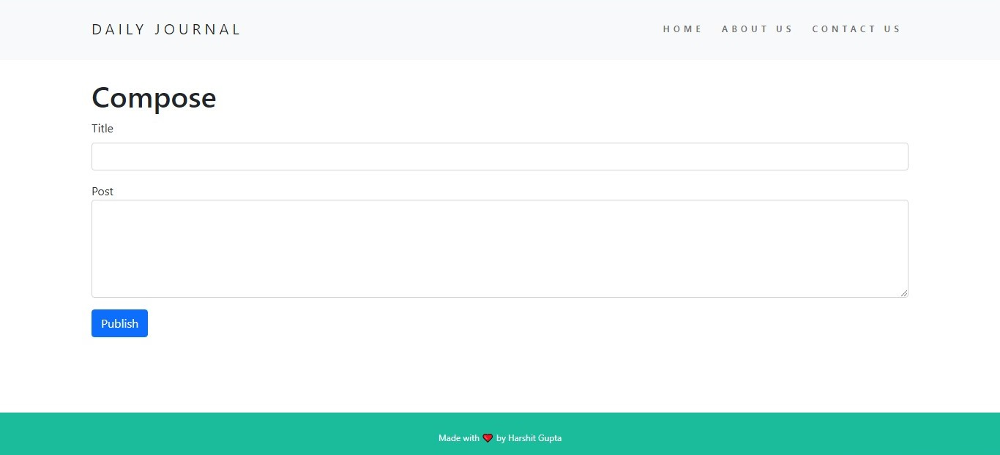

# D A I L Y_ J O U R N A L
<h4>Like to write blogs, see beta version of <a href='https://dailyjournal-blogs.herokuapp.com/'>DAILY JOURNAL.</a></h4>

  <h4>1). Click on <em>Read More</em> for full blog post.</h4>
  
  <h4>2). Blog post on full page.</h4>
  
  <h4>3). <a href='https://dailyjournal-blogs.herokuapp.com/compose'>Compose</a> Page for posting your blogs.</h4>
  
  
# Usage

 
  If you are using this app to write any thing please do not write any <em>sensitive information</em> or <em>personal information</em>, Because your blog post will be shared       with other users also.

  
# Version
<ul>
  <li>
    App Released under beta version for testing, More functionality will added find the app on <a href='https://dailyjournal-blogs.herokuapp.com/'>DAILY JOURNAL</a>     
  </li>
  <li>
    You can also add your post on the app, Write your own post <a href='https://dailyjournal-blogs.herokuapp.com/compose'>COMPOSE</a>
  </li>
</ul>  

# Contribution

 We always apricate the contribution to DAILY JOURNAL.
 

 How to do Open Source Contribution?

<ul>
  <li>
    Fork the repo into your Github Account
  <li>
    Clone this repo into your local system.
  </li>
  <li>
    Do modification you wan't (which does not affect the flow).
  </li>
  <li>
    Now push it to the repo which you forked. 
  </li>
  <li>
    Now genrate a pull request.
  </li>
  <li>
    Almost done, We will check your pull request i.e your modification, If every thing is fine then it will added to the main branch & your changes will reflect on the website.
  </li>
</ul>  
